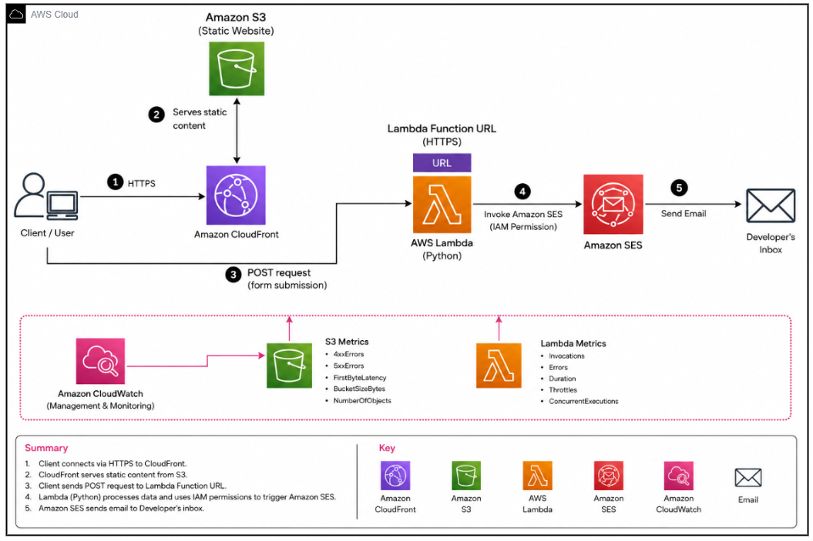

# 🌐 AWS Cloud Architect Portfolio & Serverless Backend
**A production-grade, high-availability personal portfolio and backend architected on AWS.**

---

## 📖 Project Overview
This project represents a complete transition from basic web hosting and third-party tools to a custom-built, enterprise-grade cloud infrastructure. Developed over 4 weeks during my **SIWES** placement at **Build and Ship Academy**, this portfolio demonstrates mastery in **Infrastructure Security**, **Serverless Computing**, and **Cloud Monitoring**.

## 🏗️ Architecture & System Design
The system is divided into two main components: a secure frontend delivery network and a serverless backend for communication.

### **System Data Flow**

  

  

*Architecture mapped using Draw.io, showcasing the end-to-end flow from browser request to email delivery.*

### **Infrastructure Components**
| Service | Role | Purpose |
| :--- | :--- | :--- |
| **Amazon S3** | Private Origin | Hosts static assets in a private bucket with **Block All Public Access** enabled. |
| **CloudFront** | Global CDN | Serves content via edge locations to reduce latency and provide SSL/TLS encryption. |
| **Origin Access Control (OAC)** | Security Shield | Ensures the S3 bucket is **only** accessible via CloudFront, preventing direct S3 access. |
| **AWS Lambda (Python)** | Serverless Logic | Processes contact form submissions on-demand without server overhead. |
| **Amazon SES** | Email Service | Sends processed form data directly to my verified inbox. |
| **Route 53 & ACM** | DNS & Certificates | Manages the `kefas.live` domain and handles SSL certificates for HTTPS. |

---

## 🛡️ Security & Operational Excellence

### **1. Security Best Practices**
* **Least Privilege IAM Policies:** Custom JSON policies allow the Lambda function only `ses:SendEmail` permissions and CloudFront only `s3:GetObject` permissions.
* **Encrypted Transit:** Enforced HTTPS redirects across the entire distribution.
* **Private Backend:** The backend is triggered via a secure **Lambda Function URL** with strict CORS policies.

### **2. Monitoring & Ops (Week 4)**
* **CloudWatch Alarms:** Configured real-time alerts for Lambda execution errors and S3 traffic spikes.
* **AWS Budgets:** Implemented a **$5 billing alert** to monitor cost and protect Free Tier eligibility.

---

## 🧠 Technical Challenges & Iterations

> ### **Challenge: The OAC "Access Denied" (403) Error**
> **Problem:** Moving from public S3 hosting to OAC initially caused 403 errors.
> **Solution:** Identified that OAC requires the S3 REST endpoint. I updated the S3 Bucket Policy with a unique `SourceArn` condition to complete the security "handshake."

> ### **Challenge: Mastering CORS**
> **Problem:** The frontend was blocked from communicating with the Lambda Function URL during form submission.
> **Solution:** Instead of using a wide-open wildcard (`*`), I explicitly configured **Allowed Origins** for `https://kefas.live`. This ensured the form was functional without compromising security.

---

## 🛠️ Tech Stack
* **Cloud:** AWS (S3, CloudFront, Lambda, SES, Route 53, ACM, IAM, CloudWatch)
* **Frontend:** HTML5, CSS3, JavaScript (Fetch API)
* **DevOps/Tools:** Git, GitHub, Excalidraw

---

## 👨‍💻 About the Author
**Kefas Etiku Francis** *B.Sc. Computer Science Student at **Miva Open University*** *SIWES Trainee at **Build and Ship Academy***

---
*Built with ❤️ and AWS Serverless.*
